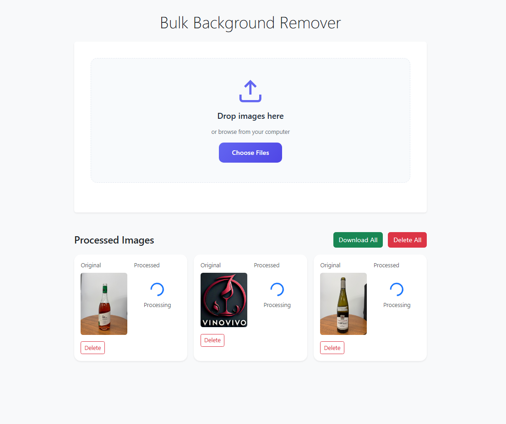
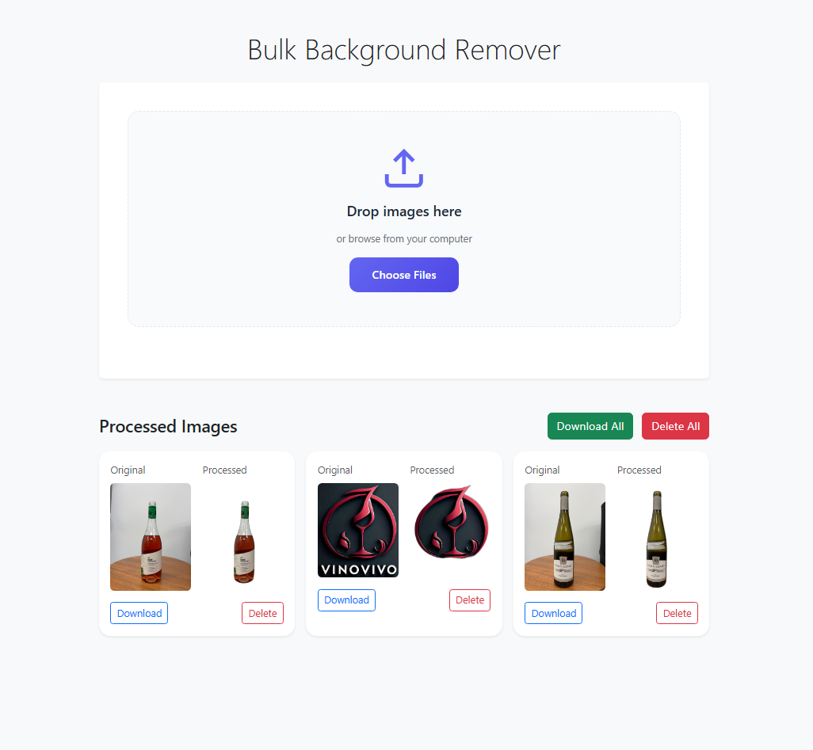

# Bulk Image Background Remover

A Django application that allows users to upload multiple images and remove their backgrounds using the rembg library, powered by Celery for asynchronous processing.

## Prerequisites

- Python 3.8+
- Redis Server
- Virtual Environment (recommended)

## Installation

1. Clone the repository:
```bash
git clone <repository-url>
cd imagebgremover
```

2. Create and activate virtual environment:
```bash
python -m venv venv
source venv/bin/activate  # On Windows: venv\Scripts\activate
```

3. Install required packages:
```bash
pip install django celery redis rembg Pillow django-celery-results
```

4. Apply database migrations:
```bash
python manage.py makemigrations
python manage.py migrate
```

5. Start Redis server:
- On Windows: Start Redis server using Windows Subsystem for Linux (WSL) or Redis Windows
- On Linux/Mac: `redis-server`

## Running the Application

1. Start Celery worker:
```bash
celery -A imagebgremover worker --pool=solo -l info
```

2. Run Django development server:
```bash
python manage.py runserver
```

3. Access the application at: `http://localhost:8000`

## Project Structure

- `bulkremover/` - Main application directory
  - `models.py` - Contains ImageUpload model
  - `tasks.py` - Celery tasks for background processing
  - `views.py` - API endpoints and view functions
  - `urls.py` - URL routing configuration

## Features

- Multiple image upload support
- Asynchronous background removal processing
- Progress tracking for each image
- Download individual processed images
- Bulk download of all processed images
- Delete individual or all images

## Screenshots

### Upload Interface


### Processing Results


## Additional Notes

- Processed images are stored in the `media/` directory
- The application uses Redis as message broker for Celery
- Background removal is performed using the rembg library

